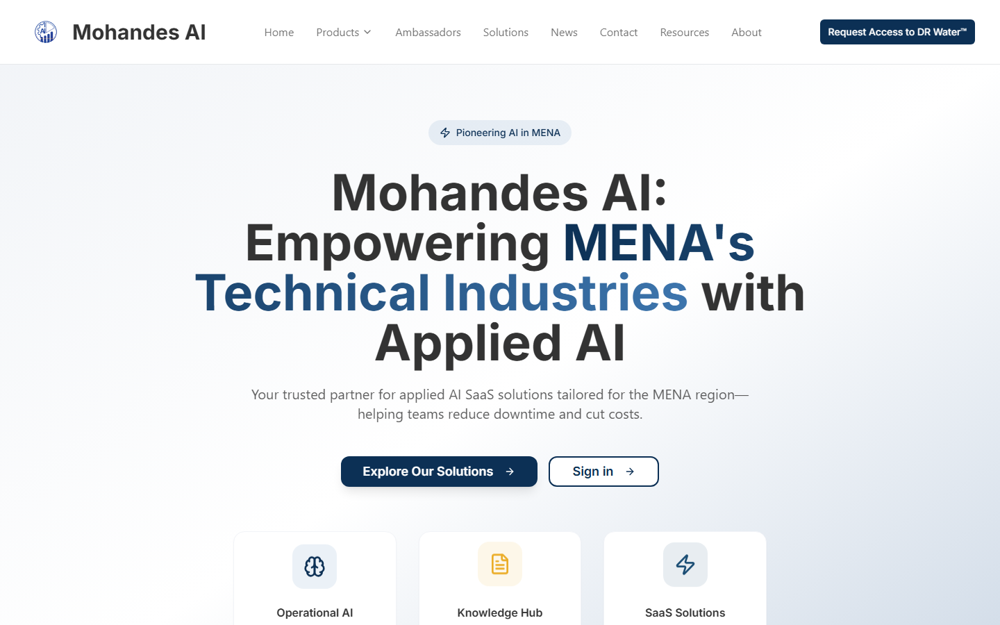

<b>Status:</b> Live &nbsp;·&nbsp; <b>Built by</b> <a href="https://github.com/Mohanad1st">Mohannad Hesham</a> &nbsp;·&nbsp; <b>Source:</b> private

ذكاء اصطناعي تطبيقي للصناعات التقنية في المنطقة العربية

> **This is a showcase, not the code.** The source is private because it runs a live product. This page shows what it does and how it was built, not the code itself. A live walkthrough is available on request.

## The problem

Engineers and technicians at water treatment plants need fast, reliable maintenance answers, but verified technical documentation in Arabic is hard to reach, and every hour of troubleshooting costs the plant. Mohandes AI is the product home for Dr. Water, an assistant for plant maintenance, with access granted per person rather than open to anyone. (Dr. Water OS, the plant operations platform, is a separate product with its own case study.)

## What it does

- A bilingual product site with full right-to-left switching
- The Dr. Water assistant, with chat history per session
- Access by request and approval, not open sign-up
- Star ratings on answers, reviewed by the team
- An admin back office for access requests, users and analytics

## See it

**[Visit mohandes-ai.com →](https://mohandes-ai.com)**

 Homepage

All screens show demo data or public pages only.

## Built with

React · TypeScript · Tailwind CSS · PostgreSQL with auth and serverless functions · transactional email

## Built responsibly

- Role-based back office with separate viewer, moderator and admin levels
- The assistant is gated: people request access and are approved
- A feedback loop on every answer, reviewed by staff

## What it deliberately doesn't do

- The assistant does not replace a qualified engineer's sign-off on plant work.

## More from Mohandes AI

- [Dr. Water OS](https://github.com/Mohanad1st/dr-water-os-showcase) — Daily operations for water treatment plants, in one bilingual system

---

© 2026 Mohannad Hesham. Showcase text and images only — no source code is published or licensed here. See all my work on <a href="https://github.com/Mohanad1st">my GitHub profile</a> · <a href="https://www.linkedin.com/in/mohannadhesham/">LinkedIn</a>.
