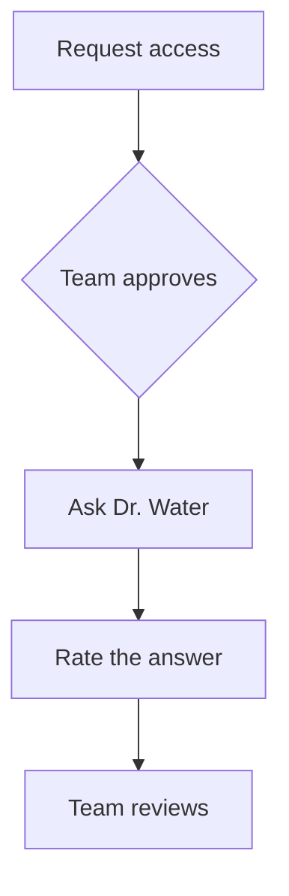

<b>Applied AI for technical teams in MENA, starting with water treatment</b>

ذكاء اصطناعي تطبيقي للفرق الفنية في المنطقة العربية، بدءًا من معالجة المياه

<b>Status:</b> Live &nbsp;·&nbsp; <b>Built by</b> <a href="https://github.com/Mohanad1st">Mohannad Hesham</a>

> This is a case study. The source is private because it runs a live product.

## Why we built it

Engineers and technicians at water treatment plants need fast, reliable maintenance answers, but verified technical documentation in Arabic is hard to reach, and troubleshooting delays cost plants money. Mohandes AI is the home of Dr. Water, an assistant for plant maintenance. Access is granted per person, not open to anyone.

## What it does

- A bilingual product site with full right-to-left switching.
- The Dr. Water assistant, with chat history per session.
- Access to the assistant by request, not open sign-up.
- Star ratings on answers, which the team can review.
- An admin back office for access requests, users, analytics and chat review.

## How it works

**[Visit the Mohandes AI site](https://mohandes-ai.com)**

## What it's built on

React · TypeScript · Tailwind CSS · PostgreSQL with auth and serverless functions · transactional email

## Safeguards

- A role-based back office, with separate viewer, moderator and admin levels.
- The assistant is gated: people request access and are approved.
- Every answer can be rated, and staff can review the ratings.

## What's not solved yet

- Staff can read users' chats with the assistant, for quality review.

## What it doesn't do

- It's meant to support engineers, not replace their judgement.

## More from Mohandes AI

- [Dr. Water OS](https://github.com/Mohanad1st/dr-water-os-showcase) — Daily operations for water treatment plants, in one bilingual system

---

© 2026 Mohannad Hesham. Showcase text and images only — no source code is published or licensed here. See all my work on <a href="https://github.com/Mohanad1st">my GitHub profile</a> · <a href="https://www.linkedin.com/in/mohannadhesham/">LinkedIn</a>.
